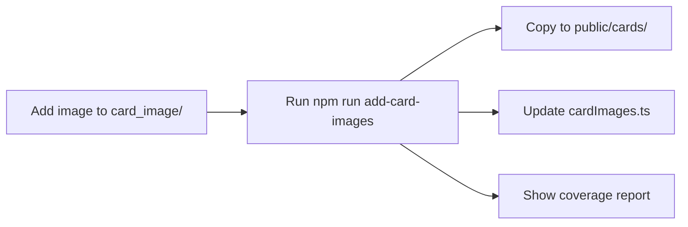

# 🖼️ Card Image Automation Guide

Automated system for adding credit card images to CardGPT.

## ✅ Status

- **THI-28**: ✅ Done (Single-select merchant tags)
- **THI-29**: ✅ Done (Smart category matching)
- **THI-23**: 🔄 In Progress (Card images - automation ready)

## 🚀 Quick Start

### Adding New Card Images

1. **Find the card ID** from `src/data/cards.json`:
   ```bash
   jq -r '.cards[] | "\(.id) - \(.name)"' src/data/cards.json
   ```

2. **Add image** to `card_image/` folder:
   - Filename: `{card-id}.png`
   - Example: `citi-cash-back.png`, `sc-smart.png`

3. **Run automation**:
   ```bash
   npm run add-card-images
   ```

4. **Done!** The script automatically:
   - ✅ Copies images to `public/cards/`
   - ✅ Updates `src/lib/cardImages.ts`
   - ✅ Shows missing card images

## 📊 Current Coverage

**Cards with images (8/10):**
- ✅ dbs-black-world
- ✅ hang-seng-enjoy
- ✅ hsbc-everymile
- ✅ hsbc-red
- ✅ sc-cathay-priority-banking
- ✅ sc-cathay-priority-private
- ✅ sc-cathay-standard
- ✅ sc-simply-cash

**Missing images (2/10):**
- ⚠️ citi-cash-back.png
- ⚠️ sc-smart.png

## 🎨 Image Guidelines

### Technical Requirements
- **Format**: PNG (preferred), JPG, or JPEG
- **Naming**: Exactly match card ID from cards.json
- **Size**: 300x200px (3:2 aspect ratio recommended)
- **File Size**: < 100KB for optimal performance

### Quality Standards
- High resolution, clear card image
- Consistent styling across all cards
- Professional product photography
- Optimized for web (use TinyPNG, ImageOptim)

## 🔧 How the Automation Works



### Script Features
1. **Auto-detection**: Scans `card_image/` folder
2. **Smart copying**: Copies all PNG/JPG/JPEG files
3. **Code generation**: Auto-updates TypeScript file
4. **Coverage report**: Shows missing images
5. **Validation**: Compares against cards.json

## 📝 Example Workflow

```bash
# 1. Check which cards need images
npm run add-card-images

# Output:
# Missing card images:
#   - citi-cash-back.png
#   - sc-smart.png

# 2. Add images to card_image/ folder
# card_image/citi-cash-back.png
# card_image/sc-smart.png

# 3. Run automation
npm run add-card-images

# Output:
# ✅ Done! Card images updated successfully
# Cards with images: 10
# Cards missing images: 0

# 4. Test locally
npm run dev
# Visit http://localhost:3000 and test recommendations
```

## 🧪 Testing

After adding images:

1. **Start dev server**:
   ```bash
   npm run dev
   ```

2. **Test recommendations**:
   - Submit any query
   - Verify card images display correctly
   - Check fallback placeholder for missing images

3. **Verify in DevTools**:
   - Check Network tab for image loading
   - Ensure no 404 errors
   - Confirm Next.js Image optimization

## 📦 Files Involved

| File | Purpose |
|------|---------|
| `card_image/` | Source images (version controlled) |
| `public/cards/` | Served images (auto-generated) |
| `src/lib/cardImages.ts` | Image mapping (auto-generated) |
| `scripts/add-card-images.sh` | Automation script |
| `package.json` | npm script alias |

## 🎯 Next Steps for THI-23

To complete THI-23:

1. **Get missing card images**:
   - citi-cash-back.png (Citi Cash Back Card)
   - sc-smart.png (SC Smart Card)

2. **Add to card_image/ folder**

3. **Run automation**:
   ```bash
   npm run add-card-images
   ```

4. **Test and deploy**

## 💡 Pro Tips

- **Batch processing**: Add multiple images at once, script handles all automatically
- **Version control**: Keep source images in `card_image/`, don't commit `public/cards/`
- **Optimization**: Optimize images before adding (reduces bundle size)
- **Consistency**: Use same aspect ratio for all cards for better UI alignment
- **Fallback**: Cards without images show placeholder automatically

## 🐛 Troubleshooting

**Images not showing?**
```bash
# Verify images exist
ls -la public/cards/

# Check cardImages.ts was updated
cat src/lib/cardImages.ts | grep CARDS_WITH_IMAGES

# Clear Next.js cache
rm -rf .next
npm run dev
```

**Script not executable?**
```bash
chmod +x scripts/add-card-images.sh
```

**Wrong card ID?**
```bash
# List all card IDs
jq -r '.cards[] | .id' src/data/cards.json
```

## 📞 Support

For issues or questions:
- Check the script output for error messages
- Verify image filenames match card IDs exactly
- Ensure images are in the correct format (PNG/JPG)
- Review the card_image/README.md for guidelines

---

**Last Updated**: 2026-01-22
**Automation Version**: 1.0
**Card Coverage**: 8/10 (80%)
